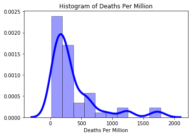
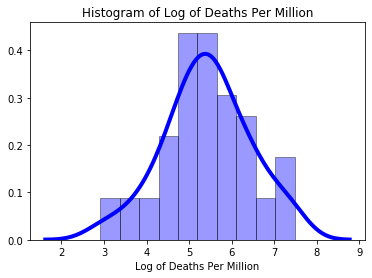

	
<h1> COVID-19: Impact of state governor and controlling features </h1>
<h2> Knowledge Discovery in Databases (DSBA-6162) Final Project </h2>
<h2> for University of North Carolina at Charlotte (UNCC) </h2>

 
<h3>Team Members:</h3> 
<ul>
<li>Hari Chamlagai     | https://github.com/chamlagaig</li>
<li>James Mason        | https://github.com/jkpm18</li>
<li>Soumyadip Mitra    | https://github.com/soumyadipmitra</li>
<li>Phil Nguyen        | https://github.com/gong-boy</li>
<li>Ramya Prakash      | https://github.com/RamyaPrakashPT</li>
</ul>

<h3>Professor:</h3>
<ul>
<li>Dr. Pamela Thompson | http://www.profthompson.net/ </li>
</ul>

<h3>Project Introduction</h3>
	
It has been several months since the COVID-19 pandemic began its rapid spread across the globe. There has been high variability in the types of responses taken by local and national leadership around the world in attempts to react to the virus with differing degrees of success. For this project we narrow our focus to the situation in the United States as we investigate the effect of the political parties of State Governors.

	
On January 11, 2020, China announced its first novel coronavirus death, and on January 21 the United States declared its first confirmed case. By March 26 the United States had the most confirmed cases in the world. Thus, it is a worthwhile endeavour to explore some of the factors involved in the growth of the virus in the U.S. We use regression analysis to determine what relationships exist, if any, between two different dependent variables (state incident rate and state death rate) and a number of state-level features including state governor’s political party, governor’s sex, governor’s age at the date of the first confirmed U.S. case, governor’s time in office at the date of first U.S. case, state’s stay-at-home order response time, testing rate, population density, median household income, state GDP, and the percent of population that is in the high-risk age group (65+).

<h3>Research Question</h3>

What is the impact of the State Governor’s Political Party in addressing Covid-19 pandemic?

<h3>Data Sources</h3>
<ol>
<li>COVID-19 Data Repository by CSSE at Johns Hopkins (https://github.com/CSSEGISandData/COVID-19)</li>
<li>U.S. Governors by Age: to obtain DOB & Inauguration Date (https://en.wikipedia.org/wiki/List_of_current_United_States_governors_by_age)</li>
<li>U.S. Governors Data: to obtain sex & political party  (https://en.wikipedia.org/wiki/List_of_United_States_governors)</li>
<li>Stay-At-Home Order Dates (https://www.kff.org/coronavirus-policy-watch/stay-at-home-orders-to-fight-covid19/)</li>	
<li> Bureau of Economic Analysis: State GDP (https://www.bea.gov/news/2020/gross-domestic-product-state-1st-quarter-2020)</li>	
<li>U.S. Census State Populations (https://www.census.gov/data/tables/time-series/demo/popest/2010s-state-total.html)</li>
<li>U.S. Census State Area Measurements (https://www.census.gov/geographies/reference-files/2010/geo/state-area.html)</li>
<li>Median Household Income by State (https://www.kff.org/other/state-indicator/median-annual-income/?currentTimeframe=0&sortModel=%7B%22colId%22:%22Location%22,%22sort%22:%22asc%22%7D)</li>	
<li>Population Distribution by Age Group (https://www.kff.org/other/state-indicator/distribution-by-age/?currentTimeframe=0&sortModel=%7B%22colId%22:%22Location%22,%22sort%22:%22asc%22%7D)</li>
<li>School Closures Data Set (unused in the models) (https://www.edweek.org/ew/section/multimedia/map-coronavirus-and-school-closures.html)</li>
<li>Policy Actions Data Set (unused in the models) (https://www.kff.org/coronavirus-covid-19/issue-brief/state-data-and-policy-actions-to-address-coronavirus/)</li>
</ol>

<h3>Application of the CRISP-DM Process</h3>

The CRISP-DM process breaks down the data mining workflow into six major phases namely Business Understanding, Data Understanding, Data Preparation, Modeling, Evaluation and Deployment. In this project, we worked on the first five phases.

While working on the Business Understanding phase, we decided to work on finding out how the different factors related to the State Governor have influenced the spread of Coronavirus infection in each state. We decided to look at when the schools were closed down in each state and how the political affiliation, age, gender and other factors related to each state’s Governor has impacted the containment of the infection.

Based on the outcome of the Business Understanding phase, in Data Understanding phase we started researching what kind of data we need and found out that we need the COVID-19 counts for each state at different time intervals, the Governor details for each state, the school closing information dataset along with few other supporting dataset.

In the Data Preparation phase, we cleaned each of the datasets and merged them together into one single dataset. We then looked at each variable, their distribution, variance and did Exploratory Data Analysis to make the data ready for modeling. We used Lasso regression to find out which features are more significant for our model.

In the Modeling phase, we used Linear Regression models to find the trends and patterns of the spread of the infection in each state and tried to find their relationships with Governor’s attributes.

We utilized the Evaluation phase to evaluate the model statistics and find inferences from the results.

<h3>Domain Knowledge</h3>

<b>COVID-19 Timeline:</b> The novel COVID-19 coronavirus outbreak, which began in Wuhan,China, in December, has expanded to touch nearly every corner of the globe. Hundreds of thousands of people around the world have been sickened and thousands of others have died. Here is the complete timeline of the outbreak:
 
https://abcnews.go.com/Health/timeline-coronavirus-started/story?id=69435165

<b>State policy actions to address covid-19 pandemic:</b> With the number of  COVID-19 cases growing rapidly in United States and around the world,on March 13, 2020, President Trump declared a state of emergency 
over the coronavirus in an effort to enhance the federal government’s response to the pandemic.

Controlling the spread of the virus requires aggressive action from the states and the federal government. States have taken a number of actions to mitigate the spread of the virus and reduce barriers to testing and treatment for those affected.States have taken several social distancing measures such as Stay At Home Order, Non Essential Business closures,Bans on large Gathering, Restaurant Limits, covid-19 health policy actions and so on.The coronavirus pandemic forced a near-total shutdown of school buildings in the spring of 2020, it was an historic upheaval of K-12 schooling in the United States. 

https://www.kff.org/coronavirus-covid-19/issue-brief/state-data-and-policy-actions-to-address-coronavirus/

<b>CDC Weekly Surveillance Summary of U.S. COVID-19 Activity:</b>
 
https://www.cdc.gov/coronavirus/2019-ncov/covid-data/covidview/index.html?CDC_AA_refVal=https%3A%2F%2Fwww.cdc.gov%2Fcoronavirus%2F2019-ncov%2Fcovid-data%2Fcovidview.html

<b>COVID-19 Data Processing Ideas:</b>
 
https://towardsdatascience.com/covid-19-data-processing-58aaa3663f6

<h3>Data Understanding and EDA</h3>

We have used different data and merged them together using the selected columns of our interest. Our project focuses on the Covid-19 pandemic in the United States. The names of the data can be found in the src code. Below is a  brief introduction of each data used:

<ol>
<li>07-24-2020_US.csv: This data is about the daily report of Covid-19 in the United States which contains information like incident rate, deaths, confirms, recovered, mortality rate etc for each state. The data was obtained from the COVID-19 Data Repository by the Center for Systems Science and Engineering (CSSE) at Johns Hopkins University.</li>

<li>GOVERNORS.csv: This data contains the governors sex, data of birth and inauguration date for each state. It was obtained from Wikipedia.</li> 

<li>CENSUS_State_Populations.csv: This data is used to obtain the population information which is used to calculate the deaths per million for each state. The data was obtained from the US Census Bureau. </li>

<li>CENSUS_StateAreaMeasurements.csv: This data obtained from the US Census Bureau gives the area of states. This data is used to obtain the population density for each state.</li>

<li>HH_Income.csv: This data obtained from the Kaiser Family Foundation contains the median family income for each state. </li>

<li>State_GDP.csv: This data obtained from the Bureau of Economic Analysis, U.S. Department of Commerce. It contains the GDP of each state. </li>

<li>State_Stay_At_Home_Dates.csv: This data is used to obtain the stay at home order for each state. Nine states have missing values because the state at home order was not issued in those states when the data was published. </li>

<li>Population_Distribution_by_Age.csv: This data obtained from the Kaiser Family Foundation  is used to obtain the population of 65+ people in each state. </li>

After the base data set is created, different types of exploratory data analysis are performed to obtain the   underlying patterns, structure,trends and relationships among different variables. Histograms and box plots are used to check the normality and distribution of variables like Incident_Rate, DeathPerMillion and LogDeathPerMillion etc. Heatmap is used to check the correlation among our dependent and predictive variables. Scatter plots matrix is used to visualize the relationship among our variables of interest. Similarly, diagnostic plots matrix is used to visualize the relationship between actual virus predicted incident rate for both training and testing data.

We examined the distribution density of the numeric variables of interest and transformed them as required for our modeling.

<table>
	<tr>
		<td>
			

		</td>
		<td>
			

		</td>
	<tr>
</table>
	

<h3>Date Preparation</h3>

We merged data from nine different publicly-available online sources (listed in the Data Sources section above) to create a base data set of potentially insightful features for all 50 states. The variables of interest from the data set we created are listed below. Of those, only Incident_Rate and Testing_Rate were taken directly from a source data set. The other ten columns were derived from features provided by the various data sources. Note that some of the predictor variables were ultimately dropped for various reasons. For example, Gov_Age_at_Onset and Pct_65Plus both were dropped due to high VIF scores indicating multicollinearity issues, and SAHO_Response_Time (the only column for which imputation was required) was dropped because it was not significant in either model (with p-values above 0.9).
<ul>
	<li>Dependent Variables</li>
	<ul>
		<li><b>Incident_Rate</b>: Cases per 100,000 persons</li>
		<li><b>log_DeathsPerMillion</b>: Natural log of the number of deaths per million persons</li>
	</ul>
	<li>Predictor Features Explored</li>
	<ul>
		<li><b>Testing_Rate</b>: Number of tests per 100,000 persons</li>
		<li><b>Population_Density</b>: Number of people per square mile</li>
		<li><b>Med_HHI_thousands</b>: Median household income (in thousands of dollars)</li>
		<li><b>GDP_Billions</b>: State GDP (in thousands of dollars)</li>
		<li><b>Sex_F</b>: Sex (1 if female, 0 if male)</li>
		<li><b>Party_Democratic</b>: Political party (1 if Democratic, 0 if Republican)</li>
		<li><b>Gov_Tenure_at_Onset</b>: Number of months governor was in office as of 01/21/2020</li>
		<li><b>Gov_Age_at_Onset</b>: Age in years of governor as of 01/21/2020</li>
		<li><b>SAHO_Response_Time</b>: Number of days between 01/21/2020 and stay-at-home order</li>
		<li><b>Pct_65Plus</b>: Percent of each state’s residents who are 65+ years old</li>
	</ul>
</ul>

Our primary source of data was the COVID-19 Data Repository by the Center for Systems Science and Engineering (CSSE) at Johns Hopkins University. From that GitHub repository we were able to obtain a daily data set containing various metrics per state such as confirmed case count, death count, recovered count, active case count, incident rate, testing count, testing rate, hospitalization count, hospitalization rate, and mortality rate. For this analysis we worked with the data from the July 24, 2020 U.S. daily report.

The two dependent variables used to build the two regression models for this analysis were taken from the Johns Hopkins data set. Incident_Rate is defined on the Johns Hopkins GitHub repository as the number of cases per 100,000 people. The Johns Hopkins data also contains a variable called Deaths which is the cumulative total number of deaths for each state, and the values in this column were divided by state population and then again divided by 1,000,000 to create the column DeathsPerMillion. Because DeathsPerMillion is highly right skewed a log transformation was applied to this column to create the variable log_DeathsPerMillion. Testing rate was the only column from the Johns Hopkins data set used as a predictor variable (Testing_Rate) in the model. This column is defined as the total number of test results per 100,000 persons.

We obtained a number of other variables across a range of sources. Once columns for governor’s date of birth and date of inauguration were obtained, a column (Gov_Age_at_Onset) was created containing governor’s age in years as of January 21, 2020 (the date of the first confirmed U.S. case), and a column (Gov_Tenure_at_Onset) was created containing the number of months each governor had been in office as of January 21st. A wikipedia article (listed above) contained each governor’s political party (Democratic or Republican), and the images of each governor in the article were used to create a column for the sex of the governor. These two columns were then one-hot-encoded to produce the binary variables Sex_F (1 if female, 0 if male) and Party_Democratic (1 if democratic, 0 if republican). 

The Bureau of Economic Analysis provided state GDP in millions. The column GDP_Billions was created by dividing that number by 1,000. The U.S. Census provided state populations and state area measurements. These features were combined to create the column Population_Density, which is the number of people per square mile. The website www.kff.org provided state stay-at-home order dates, median household income by state, and the distribution of each state’s population by age group. The variable SAHO_Response_Time was derived from this data by calculating the number of days between January 21 and the date each state’s stay at home order went into effect. There were nine states that never issued stay-at-home orders, so these missing values were imputed with the date 07/24/2020. The variable Med_HHI_thousands was created by dividing the median household income in each state by 1,000. The variable Pct_65Plus was created by multiplying the value provided by kff.org by 100 so that the column contains a percentage instead of a ratio. 

Dealing with class imbalance was not applicable in this regression context as the dependent variables were both continuous numeric variables. Regarding outliers, New York and New Jersey were outliers in terms of their deaths per million people. However, it was decided to leave them in the final analysis because we wanted to assess the response from all 50 states.

<h3>Machine Learning</h3>

Incident_Rate Model Results (with OLS fit to all 50 states):

log_DeathsPerMillion Model Results (with OLS fit to all 50 states):

<h3>Evaluation</h3>  	  	

<h3>Known Issues (problems with predictors, reporting, bias, etc.)</h3>

One significant issue might be that there is not necessarily uniformity in how states report testing, deaths, hospitalizations, and confirmed cases. So this must be kept in mind when comparing numbers between the states. Another issue is sample size. When building a model using predictor variables to model the Incident Rate and Death Rate per state, the data by definition will only have 50 observations (one observation for each state). So the size of the data set for such an analysis is not as large as most “big data” data sets. 

 
 
<h3>Conclusion</h3>
 
