<h1 align="center"> COVID-19: Impact of state governor and controlling features </h1>
<h2 align="center"> Knowledge Discovery in Databases (DSBA-6162) Final Project </h2>
<h2 align="center"> for University of North Carolina at Charlotte (UNCC) </h2>

<h3>Team Members:</h3> 
<ul>
<li>Hari Chamlagai     | https://github.com/chamlagaig</li>
<li>James Mason        | https://github.com/jkpm18</li>
<li>Soumyadip Mitra    | https://github.com/soumyadipmitra</li>
<li>Phil Nguyen        | https://github.com/gong-boy</li>
<li>Ramya Prakash      | https://github.com/RamyaPrakashPT</li>
</ul>

<h3>Professor:</h3>
<ul>
<li>Dr. Pamela Thompson | http://www.profthompson.net/ </li>
</ul>

<h3>Project Introduction</h3>
	
It has been several months since the COVID-19 pandemic began its rapid spread across the globe. There has been high variability in the types of responses taken by local and national leadership around the world in attempts to react to the virus with differing degrees of success. For this project we narrow our focus to the situation in the United States as we investigate the effect of the political parties of State Governors.

	
On January 11, 2020, China announced its first novel coronavirus death, and on January 21 the United States declared its first confirmed case. By March 26 the United States had the most confirmed cases in the world. Thus, it is a worthwhile endeavour to explore some of the factors involved in the growth of the virus in the U.S. We use regression analysis to determine what relationships exist, if any, between two different dependent variables (state incident rate and state death rate) and a number of state-level features including state governor’s political party, governor’s sex, governor’s age at the date of the first confirmed U.S. case, governor’s time in office at the date of first U.S. case, state’s stay-at-home order response time, testing rate, population density, median household income, state GDP, and the percent of population that is in the high-risk age group (65+).

<h3>Research Question</h3>

What is the impact of the State Governor’s Political Party in addressing Covid-19 pandemic?

<h3>Data Sources</h3>
<ol>
<li>COVID-19 Data Repository by CSSE at Johns Hopkins (https://github.com/CSSEGISandData/COVID-19)</li>
<li>U.S. Governors by Age: to obtain DOB & Inauguration Date (https://en.wikipedia.org/wiki/List_of_current_United_States_governors_by_age)</li>
<li>U.S. Governors Data: to obtain sex & political party  (https://en.wikipedia.org/wiki/List_of_United_States_governors)</li>
<li>Stay-At-Home Order Dates (https://www.kff.org/coronavirus-policy-watch/stay-at-home-orders-to-fight-covid19/)</li>	
<li> Bureau of Economic Analysis: State GDP (https://www.bea.gov/news/2020/gross-domestic-product-state-1st-quarter-2020)</li>	
<li>U.S. Census State Populations (https://www.census.gov/data/tables/time-series/demo/popest/2010s-state-total.html)</li>
<li>U.S. Census State Area Measurements (https://www.census.gov/geographies/reference-files/2010/geo/state-area.html)</li>
<li>Median Household Income by State (https://www.kff.org/other/state-indicator/median-annual-income/?currentTimeframe=0&sortModel=%7B%22colId%22:%22Location%22,%22sort%22:%22asc%22%7D)</li>	
<li>Population Distribution by Age Group (https://www.kff.org/other/state-indicator/distribution-by-age/?currentTimeframe=0&sortModel=%7B%22colId%22:%22Location%22,%22sort%22:%22asc%22%7D)</li>
<li>School Closures Data Set (unused in the models) (https://www.edweek.org/ew/section/multimedia/map-coronavirus-and-school-closures.html)</li>
<li>Policy Actions Data Set (unused in the models) (https://www.kff.org/coronavirus-covid-19/issue-brief/state-data-and-policy-actions-to-address-coronavirus/)</li>
</ol>

<h3>Application of the CRISP-DM Process</h3>

The CRISP-DM process breaks down the data mining workflow into six major phases namely Business Understanding, Data Understanding, Data Preparation, Modeling, Evaluation and Deployment. In this project, we worked on the first five phases.

While working on the Business Understanding phase, we decided to work on finding out how the different factors related to the State Governor have influenced the spread of Coronavirus infection in each state. We decided to look at when the schools were closed down in each state and how the political affiliation, age, gender and other factors related to each state’s Governor has impacted the containment of the infection.

Based on the outcome of the Business Understanding phase, in Data Understanding phase we started researching what kind of data we need and found out that we need the COVID-19 counts for each state at different time intervals, the Governor details for each state, the school closing information dataset along with few other supporting dataset.

In the Data Preparation phase, we cleaned each of the datasets and merged them together into one single dataset. We then looked at each variable, their distribution, variance and did Exploratory Data Analysis to make the data ready for modeling. We used Lasso regression to find out which features are more significant for our model.

In the Modeling phase, we used Linear Regression models to find the trends and patterns of the spread of the infection in each state and tried to find their relationships with Governor’s attributes.

We utilized the Evaluation phase to evaluate the model statistics and find inferences from the results.

<h3>Domain Knowledge</h3>

<b>COVID-19 Timeline:</b> The novel COVID-19 coronavirus outbreak, which began in Wuhan,China, in December, has expanded to touch nearly every corner of the globe. Hundreds of thousands of people around the world have been sickened and thousands of others have died. Here is the complete timeline of the outbreak:
 
https://abcnews.go.com/Health/timeline-coronavirus-started/story?id=69435165

<b>State policy actions to address covid-19 pandemic:</b> With the number of  COVID-19 cases growing rapidly in United States and around the world,on March 13, 2020, President Trump declared a state of emergency 
over the coronavirus in an effort to enhance the federal government’s response to the pandemic.

Controlling the spread of the virus requires aggressive action from the states and the federal government. States have taken a number of actions to mitigate the spread of the virus and reduce barriers to testing and treatment for those affected.States have taken several social distancing measures such as Stay At Home Order, Non Essential Business closures,Bans on large Gathering, Restaurant Limits, covid-19 health policy actions and so on.The coronavirus pandemic forced a near-total shutdown of school buildings in the spring of 2020, it was an historic upheaval of K-12 schooling in the United States. 

https://www.kff.org/coronavirus-covid-19/issue-brief/state-data-and-policy-actions-to-address-coronavirus/

<b>CDC Weekly Surveillance Summary of U.S. COVID-19 Activity:</b>
 
https://www.cdc.gov/coronavirus/2019-ncov/covid-data/covidview/index.html?CDC_AA_refVal=https%3A%2F%2Fwww.cdc.gov%2Fcoronavirus%2F2019-ncov%2Fcovid-data%2Fcovidview.html

<b>COVID-19 Data Processing Ideas:</b>
 
https://towardsdatascience.com/covid-19-data-processing-58aaa3663f6

<h3>Data Understanding and EDA</h3>

We have used different data and merged them together using the selected columns of our interest. Our project focuses on the Covid-19 pandemic in the United States. The names of the data can be found in the src code. Below is a  brief introduction of each data used:

<ol>
	<li><b>07-24-2020_US.csv:</b> This data is about the daily report of Covid-19 in the United States which contains information like incident rate, deaths, confirms, recovered, mortality rate etc for each state. The data was obtained from the COVID-19 Data Repository by the Center for Systems Science and Engineering (CSSE) at Johns Hopkins University.</li>

<li><b>GOVERNORS.csv:</b> This data contains the governors sex, data of birth and inauguration date for each state. It was obtained from Wikipedia.</li> 

<li><b>CENSUS_State_Populations.csv:</b> This data is used to obtain the population information which is used to calculate the deaths per million for each state. The data was obtained from the US Census Bureau. </li>

<li><b>CENSUS_StateAreaMeasurements.csv:</b> This data obtained from the US Census Bureau gives the area of states. This data is used to obtain the population density for each state.</li>

<li><b>HH_Income.csv:</b> This data obtained from the Kaiser Family Foundation contains the median family income for each state. </li>

<li><b>State_GDP.csv:</b> This data obtained from the Bureau of Economic Analysis, U.S. Department of Commerce. It contains the GDP of each state. </li>

<li><b>State_Stay_At_Home_Dates.csv:</b> This data is used to obtain the stay at home order for each state. Nine states have missing values because the state at home order was not issued in those states when the data was published. </li>

<li><b>Population_Distribution_by_Age.csv:</b> This data obtained from the Kaiser Family Foundation  is used to obtain the population of 65+ people in each state. </li>

After the base data set is created, different types of exploratory data analysis are performed to obtain the   underlying patterns, structure,trends and relationships among different variables. Histograms and box plots are used to check the normality and distribution of variables like Incident_Rate, DeathPerMillion and LogDeathPerMillion etc. Heatmap is used to check the correlation among our dependent and predictive variables. Scatter plots matrix is used to visualize the relationship among our variables of interest. Similarly, diagnostic plots matrix is used to visualize the relationship between actual virus predicted incident rate for both training and testing data.

We examined the distribution density of the numeric variables of interest and transformed them as required for our modeling.

<table>
	<tr>
		<td>
			

		</td>
		<td>
			

		</td>
	</tr>
	<tr>
		<td>
			
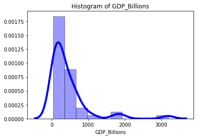

		</td>
		<td>
			
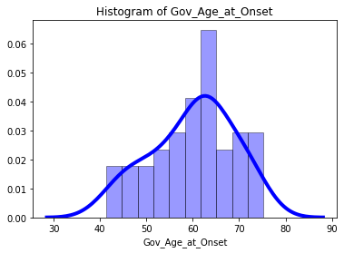

		</td>
	</tr>
	<tr>
		<tr>
		<td>
			
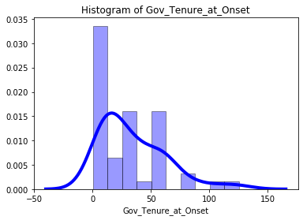

		</td>
		<td>
			
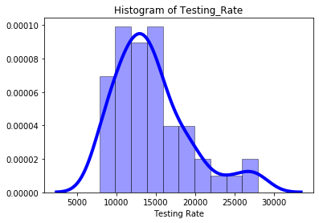

		</td>
	</tr>
	<tr>
		<td>
			
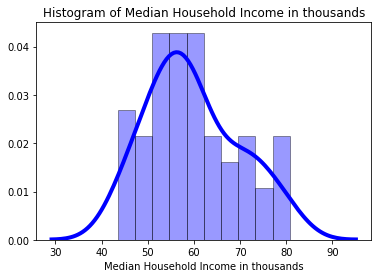

		</td>
		<td>
			
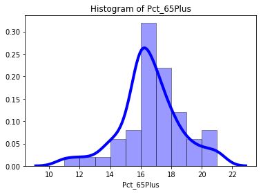

		</td>
	</tr>
	<tr>
		<td>
			
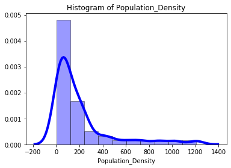

		</td>
		<td>
			
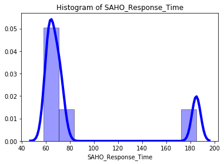

		</td>
	</tr>
	<tr>
		<td>
			
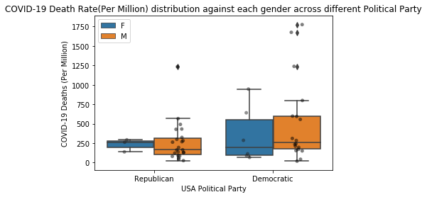

		</td>
		<td>
			
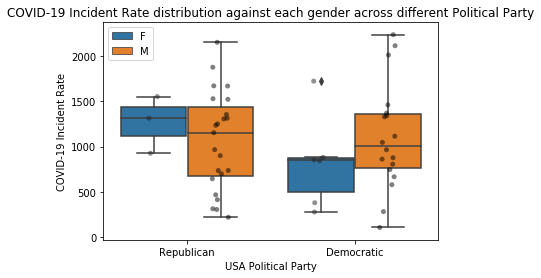

		</td>
	</tr>
	<tr>
		<td>
			
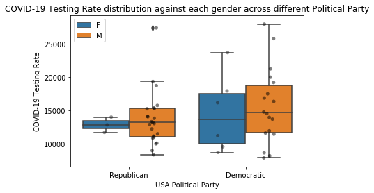

		</td>
	</tr>
</table>
	

<h3>Date Preparation</h3>

We merged data from nine different publicly-available online sources (listed in the Data Sources section above) to create a base data set of potentially insightful features for all 50 states. The variables of interest from the data set we created are listed below. Of those, only <i>Incident_Rate</i> and <i>Testing_Rate</i> were taken directly from a source data set. The other ten columns were derived from features provided by the various data sources. Note that some of the predictor variables were ultimately dropped for various reasons. For example, <i>Gov_Age_at_Onset</i> and <i>Pct_65Plus</i> both were dropped due to high VIF scores indicating multicollinearity issues, and <i>SAHO_Response_Time</i> (the only column for which imputation was required) was dropped because it was not significant in either model (with p-values above 0.9).

<ul>
	<li>Dependent Variables</li>
	<ul>
		<li><b>Incident_Rate</b>: Cases per 100,000 persons</li>
		<li><b>log_DeathsPerMillion</b>: Natural log of the number of deaths per million persons</li>
	</ul>
	<li>Predictor Features Explored</li>
	<ul>
		<li><b>Testing_Rate</b>: Number of tests per 100,000 persons</li>
		<li><b>Population_Density</b>: Number of people per square mile</li>
		<li><b>Med_HHI_thousands</b>: Median household income (in thousands of dollars)</li>
		<li><b>GDP_Billions</b>: State GDP (in thousands of dollars)</li>
		<li><b>Sex_F</b>: Sex (1 if female, 0 if male)</li>
		<li><b>Party_Democratic</b>: Political party (1 if Democratic, 0 if Republican)</li>
		<li><b>Gov_Tenure_at_Onset</b>: Number of months governor was in office as of 01/21/2020</li>
		<li><b>Gov_Age_at_Onset</b>: Age in years of governor as of 01/21/2020</li>
		<li><b>SAHO_Response_Time</b>: Number of days between 01/21/2020 and stay-at-home order</li>
		<li><b>Pct_65Plus</b>: Percent of each state’s residents who are 65+ years old</li>
	</ul>
</ul>

Our primary source of data was the COVID-19 Data Repository by the Center for Systems Science and Engineering (CSSE) at Johns Hopkins University. From that GitHub repository we were able to obtain a daily data set containing various metrics per state such as confirmed case count, death count, recovered count, active case count, incident rate, testing count, testing rate, hospitalization count, hospitalization rate, and mortality rate. For this analysis we worked with the data from the July 24, 2020 U.S. daily report.

The two dependent variables used to build the two regression models for this analysis were taken from the Johns Hopkins data set. Incident_Rate is defined on the Johns Hopkins GitHub repository as the number of cases per 100,000 people. The Johns Hopkins data also contains a variable called Deaths which is the cumulative total number of deaths for each state, and the values in this column were divided by state population and then again divided by 1,000,000 to create the column <i>DeathsPerMillion</i>. Because DeathsPerMillion is highly right skewed a log transformation was applied to this column to create the variable <i>log_DeathsPerMillion</i>. Testing rate was the only column from the Johns Hopkins data set used as a predictor variable (Testing_Rate) in the model. This column is defined as the total number of test results per 100,000 persons.

We obtained a number of other variables across a range of sources. Once columns for governor’s date of birth and date of inauguration were obtained, a column (<i>Gov_Age_at_Onset</i>) was created containing governor’s age in years as of January 21, 2020 (the date of the first confirmed U.S. case), and a column (<i>Gov_Tenure_at_Onset</i>) was created containing the number of months each governor had been in office as of January 21st. A wikipedia article (listed above) contained each governor’s political party (Democratic or Republican), and the images of each governor in the article were used to create a column for the sex of the governor. These two columns were then one-hot-encoded to produce the binary variables Sex_F (1 if female, 0 if male) and Party_Democratic (1 if democratic, 0 if republican). 

The Bureau of Economic Analysis provided state GDP in millions. The column GDP_Billions was created by dividing that number by 1,000. The U.S. Census provided state populations and state area measurements. These features were combined to create the column <i>Population_Density</i>, which is the number of people per square mile. The website www.kff.org provided state stay-at-home order dates, median household income by state, and the distribution of each state’s population by age group. The variable <i>SAHO_Response_Time</i> was derived from this data by calculating the number of days between January 21 and the date each state’s stay at home order went into effect. There were nine states that never issued stay-at-home orders, so these missing values were imputed with the date 07/24/2020. The variable <i>Med_HHI_thousands</i> was created by dividing the median household income in each state by 1,000. The variable Pct_65Plus was created by multiplying the value provided by kff.org by 100 so that the column contains a percentage instead of a ratio. 

Dealing with class imbalance was not applicable in this regression context as the dependent variables were both continuous numeric variables. Regarding outliers, New York and New Jersey were outliers in terms of their deaths per million people. However, it was decided to leave them in the final analysis because we wanted to assess the response from all 50 states.

<h3>Machine Learning</h3>

Feature selection is one of the first and important steps while performing any machine learning task.We performed feature selection to select the most important features using Lasso Regression for the regression problem of predicting, one with <b>Incident_Rate</b> as the dependent variable and another with <b>log_DeathsPerMillion</b> as the dependent variable.

We first performed feature selection using the entire dataset and then with the following potential predictor variables. The potential predictor variables to investigate are the following:

<ul>
<li>Testing_Rate</li>
<li>Sex</li>
<li>Party</li>
<li>Gov_Age_at_Onset</li>
<li>Gov_Tenure_at_Onset</li>
<li>SAHO_Response_Time</li>
<li>Population_Density</li>
<li>Med_HHI_thousands</li>
<li>GDP_Billions</li>
<li>Pct_65Plus</li>
</ul>

Lasso regression returns zero for some features coefficients when the features are redundant.This would help us confirm our variables of interest are good predictors.

<b> Feature Selection: Incident_Rate Model</b>

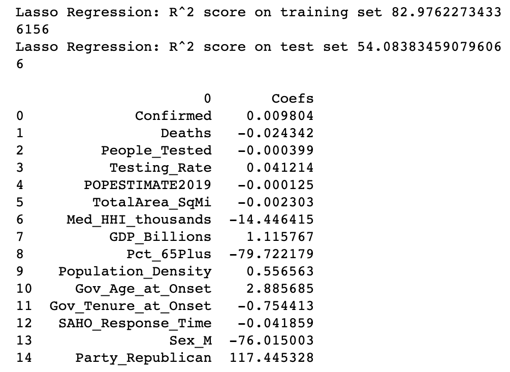

According to the Lasso regression results above, the following variables all have coefficients with very small magnitude: <i>Confirmed, People_Tested, POPESTIMATE2019, and TotalArea_SqMi</i>. This supports our suspicion that variables which normalize for things like population size or land area (such as Testing_rate or Population_Density respectively) will be more useful than their raw-count versions. 

Now performing Lasso Regression on only the variables we want to use in the model.

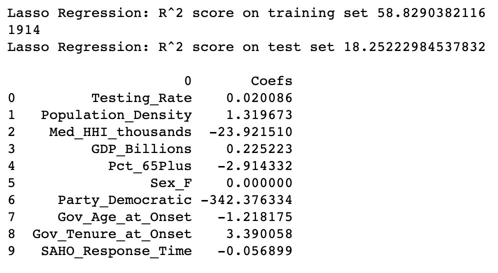

It appears that the sex of the governor is not an important variable when predicting Incident_Rate. However, we may keep it in the model to control for Sex while explaining governor effect.

<b>Feature Selection: log_DeathsPerMillion Model</b>

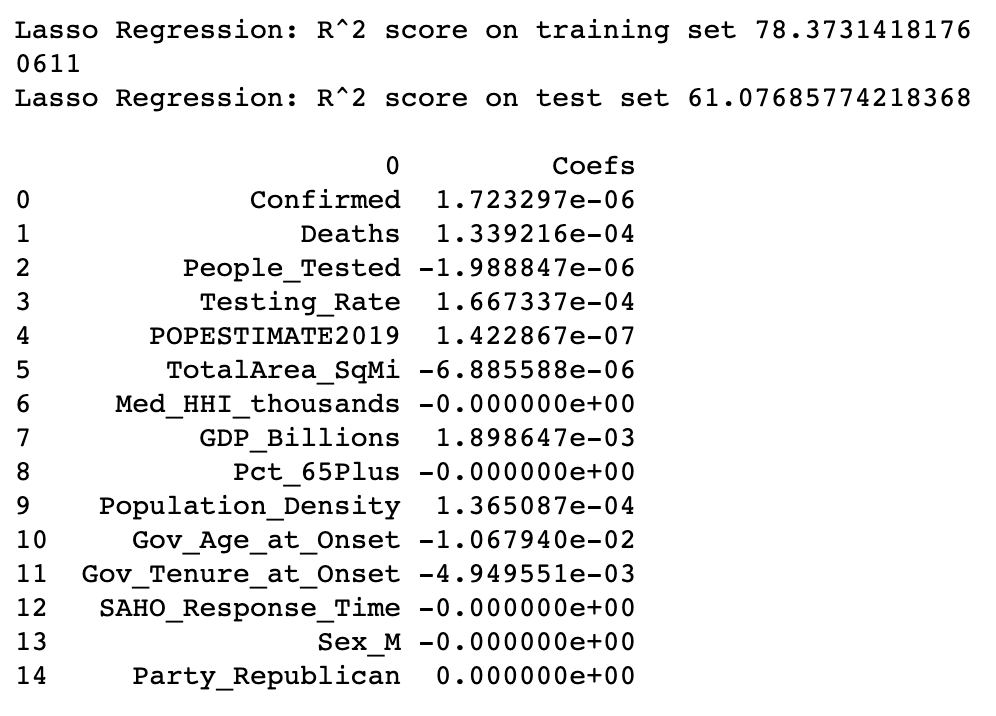

Now performing Lasso Regression on only the variables we want to use in the model.

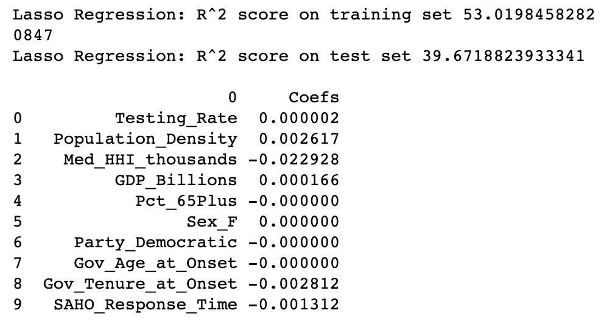

According to the Lasso Regression results, we should remove the following variables: <i>Pct_65Plus, Sex_F, Party_Democratic, & Gov_Age_at_Onset.</i>

<h3>Linear Regression</h3>

After data preparation, the next in this project was to implement a regression algorithm, where we used a linear regression model. Linear regression is a good technique to use when finding linear relationships between different variables. We implement two linear regression models, one with Incident_rate and the other log_DeathsPerMillons. Based on the performance of the first model from the R-Squared value that tells us the performance from a scale of 0 to 1 where 1 is a perfect variation while 0 indicates no variation. The score for the Incident_rate returned .602, which a is medium performance level for the model. As for the root mean square error for this model tells us the measures of how far the regression line data points are or how concentrated the data is. The model received a high value of 326.566 on train set, while the value is 581.691 on a test set. These two data variables tell us that the model is performing well and the data has a high range of data variation.

As for the log_DeathsPerMillons, we also received similar scores. The R-Squared value was a .557 which shows a good performance. As for the root mean square error gave a .669 and a .854, indicating a low form of variation in the dataset. This model gave us a low RMSE and a medium R-sq value, so out of the two models this wasn’t the best model.

TABLE 1: Incident_Rate Model Results (with OLS fit to all 50 states)

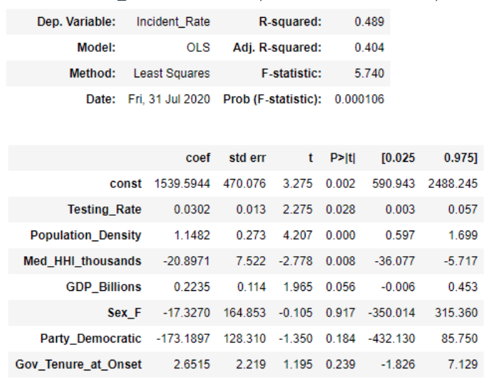

TABLE 2: log_DeathsPerMillion Model Results (with OLS fit to all 50 states)

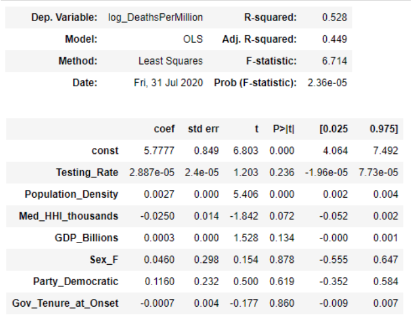

<b>Incident Rate Linear Model results with sklearn</b>

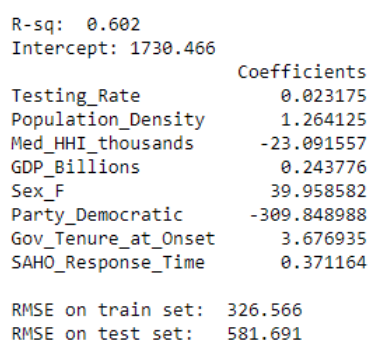

<b>log_DeathsPerMillons</b>

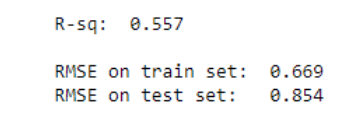

<h3>Evaluation</h3>

The models that were built in this project were evaluated using a linear regression model using Root square scores and root mean square error. The goal for this modeling was to have a high root square value in our models so that the model has a high accuracy rate. As well as a low root mean square error, showing that we do have a high accurate variation in our models. RMSE has two scores from training and test sets, where they both should have similar values if it is a good model. If the training set is lower than the test set, this could mean that the data has been over fit. But we do not have this. As for the root square values we received, the higher the R square value the better. A high root square value indicates a good model and can produce useful predictions in our data. Since some of our scores are around the .5 range, we could say that more than half of the data variation can be explained by the model input.

<h3>Known Issues (problems with predictors, reporting, bias, etc.)</h3>

One significant issue might be that there is not necessarily uniformity in how states report testing, deaths, hospitalizations, and confirmed cases. So this must be kept in mind when comparing numbers between the states. Another issue is sample size. When building a model using predictor variables to model the Incident Rate and Death Rate per state, the data by definition will only have 50 observations (one observation for each state). So the size of the data set for such an analysis is not as large as most “big data” data sets. 

 
 
<h3>Conclusion</h3>

We started our project by gathering different publicly available datasets and merging them together as one single data set with the variables of our interests. On the base data set, we preprocessed it and did some exploratory data analysis. The box plot visualization for the incident rates, death rates and/or test rates are done to understand the handling of the Covid-19 based on the political party and gender of the governors. The result of the box plots shows some differences. For example,  the democratic governors have done more testing and they have less incident rates than Republican. But the death rate is higher for Democratic governed states than Republican. The female governors in Democratic party have about equal numbers of tests as compared to the male governors. On the Republican side, male governors have done more testing. Incident rates in states governed by female governors is less in  both parties. This is because there are only 9 female governors in the country. We see less death rates in the states governed by the Republican female governor. Whereas, have about the same number of death rate Democratic male and female governors. The heat map shows there is a negative correlation between incident rate, death per millions, death rates and female governors. It also shows there is a negative correlation between death rates and Democratic governors.

The project is relevant because we are still in the pandemic phase and the United States have cases rising in many states. The death toll has surpassed 150,000. The model developed in the project can be useful insight for other researchers and students.

We build two Linear Regression models. One with <i>Incident_Rate</i> as the dependent variable and one with <i>log_DeathsPerMillion</i> as the dependent variable. We used Testing_Rate, SexSexParty, Gov_Age_at_Onset, Gov_Tenure_at_Onset, SAHO_Response_TimeP, opulation_Density, Med_HHI_thousands, GDP_Billions, and Pct_65Plus as our predictive variables.

Two models were built for this analysis. The first model used Incident_Rate (cases per 100K people) as the dependent variable. After selecting appropriate variables, the model was trained on 80% of the data (40 states) and tested on 20% (10 states) to get an idea of how well the model fit the data. The training RMSE (326.85) was much lower than than the test RMSE (586.72) indicating a possible problem with overfitting. The adjusted R-sq for the training data fit was .514 which indicates the variables explain about 51% of the variance in incident rate. Using the same seven variables, a new model was fit to all 50 states because we were interested in the nature of the relationships between predictors and incident rates across the entire U.S. The results are shown above in Table 1 of the Machine Learning section of this report. Adjusted R-sq was .404, indicating the variables actually only explain about 40% of the variability when looking at all 50 states. Looking at the p-values, Sex_F is very clearly not statistically significant at any reasonable confidence level when predicting Incident Rate, but it was kept in the model as a control variable. Party_Democratic and Gov_Tenure_at_Onset have slightly high p-values, but they would both be significant at a 25% confidence level (which is admittedly lenient).

The coefficients from Model 1 provide interesting insights. Testing_Rate has a positive coefficient, indicating that for every additional test per 100,000 people we only expect an increase in Incident_Rate of 0.03. So while more testing does result in more positive cases, the incident rate does not seem to increase as fast as the testing rate. The positive coefficient on Population_Density matches our intuition that more densely populated areas correspond to an increase in the number of positive cases. Conversely, a higher median household income for a state corresponds to a lower incident rate. It is interesting that higher GDPs correspond to higher incident rates. We will not interpret the coefficient on Sex_F because the p-value is .917. Party_Democratic seems to be associated with a lower incident rate. In fact this variable has the largest magnitude of all the variables in this model. And Gov_Tenure_at_Onset has a positive coefficient, but we will not interpret this coefficient because the variable has the second highest p-value. We are treating this variable as another control variable.

The second model (Model 2) used log_DeathsPerMillion as the dependent variable. This model was interesting because fewer variables were significant, so it appears that it is more difficult to predict death rate than it is to predict incident rate given our variable set. In fact, removing variables one at a time, to arrive at a model with only significant variables resulted in a model containing only 3 variables: Population_Density, Med_HHI_thousands, and GDP_Billions.

TABLE 3: log_DeathsPerMillion Paired-Down Model Results (with OLS fit to all 50 states):

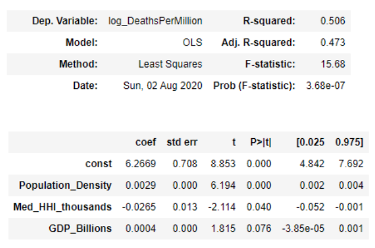

 

The above results in Table 3 were from a model fit on all 50 states using only the three significant variables. Both Population_Density and GDP_Billions have positive coefficients with very small magnitudes (0.0029 and 0.0004 respectively). The coefficient for Med_HHI_thousands (-0.0265), however, has a larger magnitude. Because we log-transformed the dependent variable we can interpret this coefficient to mean that all else being equal, for every thousand-dollar increase in a state's median household income we can expect a 2.7% decrease in deaths per million. That is a valuable insight. The data seems to confirm our intuition that states with less-wealthy residents do not fare as well during the pandemic. It is also worth noting that when fitting this paired-down model using a train/test split, the training RMSE was 0.686 while the test set RMSE was 0.799.

Because our research question is related to the governor effects on the pandemic outcomes, we did not stop at the paired-down model in Table 3. We ultimately fit a model on all 50 states using the same seven variables from Model 1. Those model results are listed above in Table 2. The p-values for all variables related to the governor (i.e. Sex_F, Party_Democratic, and Gov_Tenure_at_Onset) are very high (0.878, 0.619, and 0.860 respectively). Therefore, we cannot conclude at this time that the political party of the governor or the governor-related control variables have much of an impact on the COVID-19 death rate in a state. More research would be needed to draw any conclusions about the relationship between a state’s death rate and its governor’s politics and policies.

If you want to use our work, follow the instructions below:

<ul>
<li>Clone this repository or download it as a zip</li>
<li>Find the description of the project  in the readme file</li>
<li>Upload the source code to your jupyter notebook for your work</li>
<li>You can also get the source code of the project by going to src folder</li>
</ul>

In the future, we want to accomplish the following tasks:

<ul>
<li>Enhance our model using school closures dataset</li>
<li>Determine the impact to covid-19 progression using other social policy actions related variables from State Policy Dataset</li>
<li>Accommodate covid-19 time series data and identify any significant patterns to covid-19 progression</li>
</ul>
